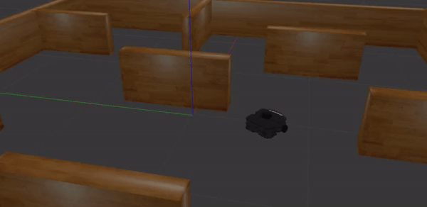

# Bug 0 Algorithm Turtlebot3 Waffle Simulation

## About
Farrel Ahmad's submission for Udemy course "ROS for Beginners II : Localization, Navigation, and SLAM" by Anis Koubaa. The bug 0 algorithm is slightly modified and integrated with P (Proportional) controller.

## How to Run
This was developed using ROS Noetic, Gazebo 11, and Ubuntu 20.04 LTS, try to use these versions.
1. clone this repository to your local computer
2. Run this command
```sh
$ cd ROS-tutorial-and-templates/catkin_ws
$ catkin_make
```
3. Install robotis turtlebot3 simulation
```sh
$ sudo apt update
$ sudo apt upgrade
$ cd ROS-tutorial-and-templates/catkin_ws/src/
$ git clone https://github.com/ROBOTIS-GIT/turtlebot3_msgs.git -b noetic-devel
$ git clone  https://github.com/ROBOTIS-GIT/turtlebot3.git -b noetic-devel
$ cd ~/ROS-tutorial-and-templates/catkin_ws && catkin_make
$ cd ~/ROS-tutorial-and-templates/catkin_ws/src/
$ git clone https://github.com/ROBOTIS-GIT/turtlebot3_simulations.git
$ cd ~/ROS-tutorial-and-templates/catkin_ws && catkin_make
```
4. Run the program
```sh
$ cd ROS-tutorial-and-templates/catkin_ws
$ catkin_make
$ source devel/setup.bash # or source devel/setup.zsh if terminal is zsh
#waffle is the robot model, can be substitued with burger or waffle_pi
$ export TURTLEBOT3_MODEL=waffle 
$ roslaunch bug0_navigation_submission bug0_nav.launch
```
5. Gazebo simulator will start and the robot will execute the bug 0 algorithm

## Result
